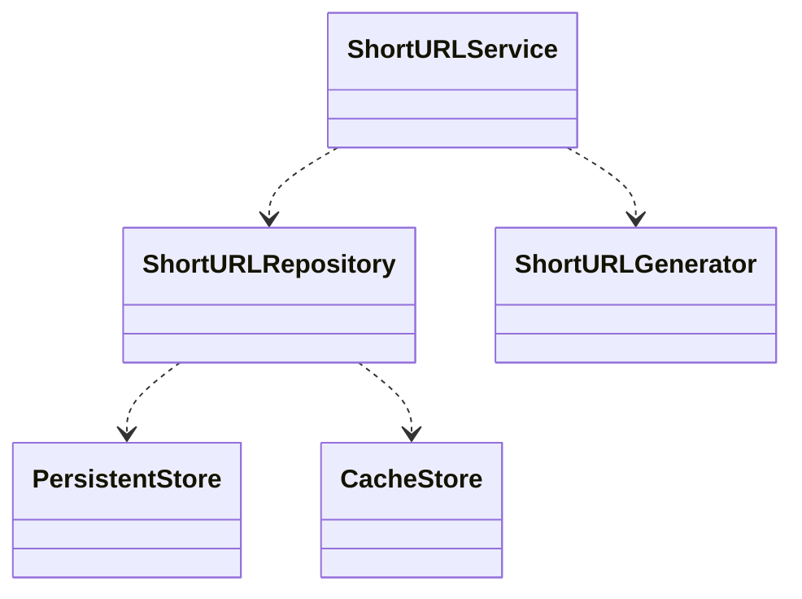

# Design

這份文件詳細說明了 url-shortener 的設計，使用的套件，與設計上的考量

## Requirement

- 提供兩個 APIs

  1. 提供一個 URL 與到期時間，response 一個 shorten URL
  2. 輸入 shorten URL，重新導向到原始 URL，如果過期需要回傳 404

- API 要有對應的驗證與 error handling
- 處理不存在 URL 的 cache
- 每天可能有上萬個 new url, Read 遠大於 Write

# 技術選擇

## short url 的長度

對於短網址來說，當然 url 越短越好，關係到了使用者體驗，以及資料庫儲存的大小，但還需要考慮 url 不容易碰撞

假設每天會產生 100,000 筆 shorten url，一年約會產生 36,500,000 筆

以 base62 表示 shorten url 時，在

- 長度 6 時會可以容納 62^6 = 56,800,235,584 筆資料
- 長度 7 時會可以容納 62^7 = 3,521,614,606,208 筆資料

假設產生 shorten url 是完全隨機時，選擇長度 6 的狀況下一年後的碰撞率約為 0.00064，長度 7 則是 0.00001

我的選擇會是 **長度 7 的 base62** 字串作為短網址，原因是我願意犧牲一點的空間來換取更低的碰撞率

## Database 的選擇

根據需求，url shortener 需要面對大流量，因此需要處理 scaling issues

而 NoSQL 具有 horizontal scaling 的能力，很符合此系統的需求。

但相對於 RDBMS 的缺點是沒有 multi-record ACID transactions, 不過在目前的 url shortener 的系統下沒有這個需求。

所以這邊會選擇 NoSQL，並使用 MongoDB

使用 MongoDB 的原因

- 本身較熟悉，有使用過的經驗
- 有 sharding 模式，可以有效的 horizontal scale

## Cache DB 選擇

Cache DB 選擇使用 Redis

- 可以使用 cluster 或 replicas 讀寫分離，來處理 scaling issue
- 支援永久性儲存，如果不幸 redis 服務壞掉，重新啟動時可以先從硬碟還原資料，可以避免大量的流量打到 database 上
- 支援 LRU cache，當超出記憶體時，可以清掉最少用到的 key
- 有使用過的經驗
- 有多種資料結構，或許會有用到的機會

記憶體大小估計

以一年約會產生 36,500,000 筆，採用 80/20 法則，抓 20% 是 7,300,000，[Redis 每 1,000,000 筆資料約占用 85MB](https://redis.io/docs/getting-started/faq/)，所以總共會需要大約 620 MB

# Code Architecture

_以上皆為 interface_

## Service

提供操作 short url 的行為

- 建立 short url
- 以 short url 查詢 original url

## Repository

處理資料相關的邏輯，例如

- 從 store 抓取資料
- cache 的機制與邏輯

## Store

處理資料庫與程式間的邊界

- persistent store 操作永久性儲存的資料

  這層抽象可以快速抽換 Database，可以看 [postgres branch 以 Postgres 作為資料庫的範例](https://github.com/WeiAnAn/url-shortener/tree/postgres)

- cache store 操作 cache 資料

## ShortURLGenerator

取得 short url id 的邏輯

目前是以 random base62 string 實作

如果想要使用其他機制，如: ID generator service，可以依照此 interface 實作

---

元件彼此相依於 interface，具備良好的抽象化

撰寫測試更容易，相依的元件可以透過注入的方式傳入 mock 進行互動與驗證，也可以很快地抽換實作

[實際案例](https://github.com/WeiAnAn/url-shortener/commit/50cf253517ac15a404cfbc7b03e36f5d0f6412df):

原先使用 pq 作為 postgres sql driver，但後來發現 pq 是 maintenance mode，而改使用 pgx。這個 commit 只要實作 pgx persistent store，再抽換掉原本的 store，可以很簡單的達成。

## Cache Problems

- Cache Penetration

  當 cache 的資料不存在 cache 中，也不存在 database 中，因此每次請求都會打到資 料庫

  實作的解法是當資料不存在 cache 中，就以空字串塞入。在從 cache 抓資料時，如果取得的是空字串，那就視為資料不存在。如此以來就可以有效地防止 cache penetration 造成的效能問題

  然而這種方式的缺點是會占用額外的記憶體空間，如果要解決這個問題的話，可以採用 Bloom Filter，可以降低使用的記憶體空間

- Hotspot Invalid (未解決)

  當一個熱門的 short url cache 失效，或是在公布一個新的 short url 時，有大量的用戶同時送出請求，這個時候因為沒有 cache 而會有大量的請求向資料庫進行查詢，造成資料庫很大的負載

  可以使用 mutex，拿到 mutex 的人才有權利進行資料庫的查詢，查詢完成後將資料放到 cache 中，再 release mutex。

## Third Party Library

- [github.com/gin-gonic/gin](https://pkg.go.dev/github.com/gin-gonic/gin@v1.9.0)

  gin 是目前 Go 主流的 web framework，在 Github 上與其他 web framework 相比擁有最高的 star

  效能佳，支援 middleware，以及有內建 payload validation

- [github.com/go-playground/validator/v10](https://pkg.go.dev/github.com/go-playground/validator/v10@v10.11.2)

  gin 內建的 validator。這個專案中用在 errorHandler，用來做 type casting

- [github.com/golang/mock](github.com/golang/mock)

  Go 官方支援的 mock module，可以使用 [mockgen](https://github.com/golang/mock#running-mockgen) 快速建立 mock，用在 unit test，可以 assert 呼叫的 arguments 與設定 return values

- [github.com/redis/rueidis](https://pkg.go.dev/mod/github.com/redis/rueidis@v1.0.6)

  rueidis 是 Go 的 redis client，被收錄於 Redis github 組織下

  選擇的原因主要是有支援 client side caching，雖然會多花一些記憶體，但可以有效增加讀取的效能

- [github.com/spf13/viper](https://pkg.go.dev/github.com/spf13/viper@v1.15.0)

  viper 是一個 config management module，有很高的 stars，有很多知名的 Go 套件都有在使用

  viper 提供了很多種方式讀取設定，例如不同格式(JSON, YAML...)的檔案、環境變數、remote config systems 等，有很好的擴充性

  在此專案主要使用環境變數讀取設定

- [go.mongodb.org/mongo-driver](https://pkg.go.dev/go.mongodb.org/mongo-driver@v1.11.6)

  mongo-driver 是由官方開發的 MongoDB Go Driver
  
  用來操作 MongoDB 

- [github.com/jackc/pgx/v5](https://pkg.go.dev/github.com/jackc/pgx/v5@v5.3.1) (only in postgres branch)

  原先使用 [pq](https://github.com/lib/pq)，但後來才發現 pq 目前是 `maintenance mode`，因而換到 pq 作者推薦的 pgx

  pgx 是 Go 的 postgres client，不像 pq 是基於 Go database/sql interface，也因此包含了除了 database/sql 所支援的功能，如 `LISTEN / NOTIFY` and `COPY` (但這個專案沒用到)

  在此專案中主要使用 pgxpool package，是 connection pool 的實作，有了 connection pool 可以有效的減少連線建立的成本

## Directory layout

Follow [golang-standards/project-layout](https://github.com/golang-standards/project-layout)

- cmd - 程式的進入點

  `server/main.go` 初始化 web server，包含載入設定、建立 DB connection、元件的初始化

- docs - 就是文件
- internal - 不對外開放的 package，由於 url shortener 不是一個 public module 所以絕大部分的 code 都放在這個資料夾內
  - config - 設定檔，設定設定的初始值
  - domain - 將相同領域的功能放在同一個子資料夾中，比起 by functional 的方式 (controllers, services dir...)，更具有內聚性
    - short_url - 與 short url 有關的都放在此資料夾，如 controller, service, repository, store 等
  - middlewares - 存放 middlewares，如: error handler
  - utils - 放一些共用 function

## TODO

- [ ] Cache Hotspot data Invalid
- [ ] Graceful shutdown
- [ ] E2E/API testing
- [ ] Shorten url collision 的 retry
- [ ] CI/CD
- [ ] Health check API
